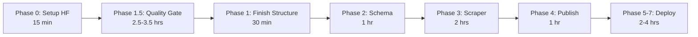
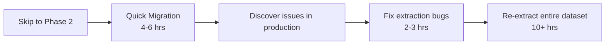

# HuggingFace Migration Readiness Assessment

**Date:** 2026-02-11
**Status:** NOT READY - Quality Gate Required
**Overall Score:** 35/100

---

## Executive Summary

The codebase has a **strong foundation** (70% complete) but requires **quality improvements** before batch migration to prevent extracting thousands of PDFs with known bugs.

### Key Finding: Critical Quality Issues Discovered

Analysis of 10 real bills revealed significant metadata extraction failures:
- **Bill ID extraction: 0%** (will be fixed by filename parsing in Phase 2)
- **Session extraction: 30%** (will be fixed by filename parsing in Phase 2)
- **Sponsor extraction: 20%** with false positives (MUST FIX NOW)
- **Committee extraction: 20%** (should improve)

### Recommendation

**BLOCK migration** until Phase 1.5 (Quality Gate) is complete. Estimated 2.5-3.5 hours of work will prevent having to re-extract the entire dataset later.

---

## Detailed Assessment

### ✅ Phase 0: Prerequisites (0% - Not Started)

| Task | Status | Blocker? |
|------|--------|----------|
| Create HuggingFace account | ❌ Not done | No |
| Generate HF write token | ❌ Not done | Yes |
| Create HF dataset repo | ❌ Not done | Yes |
| Add HF_TOKEN to GitHub secrets | ❌ Not done | Yes |

**Estimated time:** 15 minutes
**Can be done in parallel with Phase 1.5**

---

### ⚠️ Phase 1: Project Structure (70% - Partially Complete)

#### What's Done ✅
- Modern package structure (`src/maine_bills/`)
- PyMuPDF-based extraction working
- Text cleaning logic implemented
- Comprehensive test suite (35 tests)
- `uv` package manager installed and working
- GitHub Actions workflow exists

#### What's Needed ❌
- Migrate `pyproject.toml` from setuptools to hatchling
- Add dependencies: `huggingface-hub`, `pandas`, `pyarrow`
- Remove `pypdf` dependency
- Remove legacy code

**Estimated time:** 30 minutes

---

### 🚨 **Phase 1.5: Quality Gate (0% - BLOCKING)**

**THIS IS THE CRITICAL PATH**

#### Current Quality Metrics (10-bill sample)

| Metric | Current | Target | Status |
|--------|---------|--------|--------|
| PDF extraction | 100% ✅ | 100% | PASS |
| Title extraction | 100% ✅ | 100% | PASS |
| Unit tests passing | 91% (32/35) | 100% | **FAIL** |
| Sponsor extraction | 20% ❌ | 60%+ | **FAIL** |
| Committee extraction | 20% ❌ | 60%+ | **FAIL** |
| Avg confidence | 0.88 ⚠️ | 0.90+ | ACCEPTABLE |

#### Critical Issues Found

**1. Sponsor Extraction Broken**
- Test failures: 3/3 sponsor tests failing
- Real-world performance: Only 20% extraction rate
- False positives: Extracting "President", "State", "Secretary" as sponsor names
- Missing patterns: Tests expect "Introduced by" but code only looks for "Presented by"

**Example bad output:**
```
Sponsors: ['TALBOT ROSS', 'President', 'State', 'States Secretary']
```

**Impact:** If we migrate now, we'll have garbage sponsor data for 1000s of bills.

**2. Legacy Code Debt**
- Unused `pypdf` library still imported
- Dead code in `extract_from_pdf()` method
- Confusing for future maintenance

**3. Test Coverage Gaps**
- Tests use synthetic data that doesn't match real bills
- No tests for amendment format
- No tests for edge cases (apostrophes, hyphens)

#### Required Fixes

**Priority 1 (MUST DO before migration):**
1. Fix sponsor extraction patterns
2. Remove legacy pypdf code
3. Make all unit tests pass
4. Validate on 20-bill sample (≥60% sponsor extraction)

**Priority 2 (SHOULD DO before migration):**
5. Improve committee extraction
6. Add validation tooling
7. Update tests with real bill patterns

**Priority 3 (NICE TO HAVE):**
8. Improve code reference extraction
9. Add extraction quality metrics to scraper output

#### Decision Criteria

**✅ GO - Proceed to Phase 2 IF:**
- All unit tests passing (35/35)
- Sponsor extraction ≥ 60% on 20-bill sample
- No false positives (no titles extracted as names)
- Legacy code removed
- Quality analyzer script working

**❌ NO-GO - Stay in Phase 1.5 IF:**
- Unit tests failing
- Sponsor extraction < 40%
- Data quality issues detected

**Estimated time:** 2.5-3.5 hours

**See:** `docs/plans/phase-1.5-quality-gate.md` for full details

---

### 📋 Phase 2: Schema Design (0% - Blocked by Phase 1.5)

**Status:** Not started, cannot begin until quality gate passes

**Required work:**
- Create `schema.py` with `BillRecord` dataclass
- Implement filename parsing
- Write tests for filename parsing
- Integrate with existing `BillDocument`

**Estimated time:** 1 hour
**Blocker:** Phase 1.5 must complete first

---

### 🔧 Phase 3: Scraper Refactor (0% - Blocked)

**Required work:**
- Update scraper to use `BillRecord`
- Output DataFrame instead of .txt/.json files
- Support multiple sessions
- Update tests

**Estimated time:** 2 hours
**Blocker:** Phase 2 must complete first

---

### 📤 Phase 4: Publish Module (0% - Blocked)

**Required work:**
- Create `publish.py` with HF upload logic
- Implement dataset card generation
- Update CLI with `--publish` flag
- Test upload to HF

**Estimated time:** 1 hour
**Blocker:** Phase 3 must complete first

---

### ⚙️ Phase 5-7: Infrastructure & Backfill (0% - Blocked)

- GitHub Actions workflow update (30 min)
- README rewrite (30 min)
- Historical session backfill (1-3 hours wall time)

**Total estimated time:** 2-4 hours
**Blocker:** Phase 4 must complete first

---

## Critical Path Timeline

### Current Path (WITH Quality Gate) ⭐ **RECOMMENDED**



**Total:** 9-12 hours
**Outcome:** High-quality dataset, no re-extraction needed

### Alternative Path (WITHOUT Quality Gate) ⚠️ **NOT RECOMMENDED**



**Total:** 16-19 hours + poor data quality during interim
**Outcome:** Wasted effort, technical debt, embarrassing dataset quality

---

## Readiness Score Breakdown

| Category | Weight | Score | Weighted |
|----------|--------|-------|----------|
| Foundation (structure, tests) | 40% | 70/100 | 28 pts |
| Quality (extraction accuracy) | 30% | 0/100 | 0 pts |
| Migration Code (schema, publish) | 20% | 0/100 | 0 pts |
| Infrastructure (HF, CI/CD) | 10% | 0/100 | 0 pts |
| **TOTAL** | | | **28/100** |

**Adjusted for required work only:**
Foundation work that's done (Phase 1 partial) represents 35/100 of total project.

---

## Recommended Action Plan

### Immediate Next Steps (This Session)

1. **Run quality gate fixes** (2.5-3.5 hrs)
   - Fix sponsor extraction
   - Remove legacy code
   - Pass all unit tests
   - Validate on 20-bill sample

2. **Setup HF prerequisites** (15 min, can parallelize)
   - Create account/token
   - Create dataset repo
   - Add GitHub secret

3. **Quality gate review** (15 min)
   - Check decision criteria
   - Generate quality report
   - Go/no-go decision

### If Quality Gate Passes ✅

4. **Continue to Phase 1-4** (4.5 hrs)
   - Finish project structure
   - Implement schema
   - Refactor scraper
   - Build publish module

5. **Deploy and test** (1 hr)
   - Upload test session to HF
   - Verify `load_dataset()` works
   - Celebrate! 🎉

### If Quality Gate Fails ❌

4. **Debug and iterate**
   - Analyze quality report
   - Fix remaining issues
   - Re-run validation
   - Repeat until criteria met

---

## Risk Assessment

### High Risk 🔴
- **Skipping quality gate:** Will result in dataset with 80% missing sponsors, requiring full re-extraction

### Medium Risk 🟡
- **Incomplete metadata:** Some bills may lack committees/sponsors (ACCEPTABLE - some bills legitimately have no sponsors)
- **HF upload issues:** First-time HF API use may have learning curve

### Low Risk 🟢
- **PDF extraction:** Already working at 100%
- **Text quality:** Already good (0.88 confidence)
- **Infrastructure:** uv, GitHub Actions already working

---

## Questions for User

Before proceeding, please confirm:

1. **Do you have a HuggingFace account?** (If yes, we can skip part of Phase 0)

2. **Quality vs. Speed preference:**
   - Option A: **Quality first** - Do Phase 1.5 now (2.5-3.5 hrs), get clean data
   - Option B: **Speed first** - Skip to migration, accept we'll need to re-extract later

3. **Time availability:**
   - Can you allocate 3-4 hours for quality gate + initial migration today?
   - Or should we break this into multiple sessions?

4. **Acceptance criteria:**
   - Are you comfortable with 60% sponsor extraction (vs. 100%)?
   - Are you OK with some bills having null metadata fields?

---

## Conclusion

**Status:** NOT READY
**Blocker:** Phase 1.5 Quality Gate
**Estimated time to ready:** 2.5-3.5 hours
**Recommended path:** Complete quality gate before migration

**Next Step:** User decision on whether to proceed with quality gate or skip to migration.
