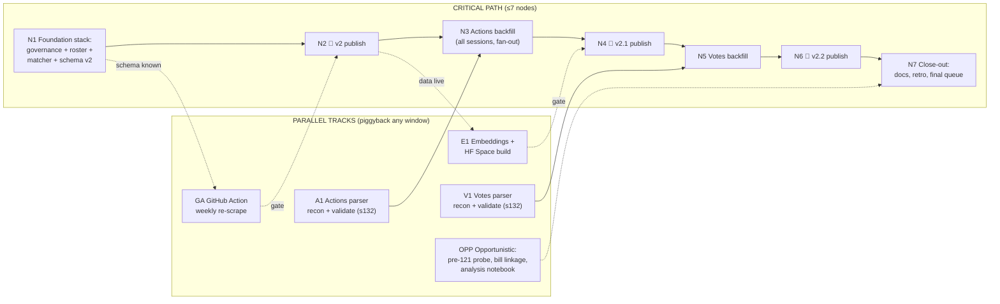

# Sprint Plan: Dataset v2+ — Dependency Graph, 7-Node Critical Path

**Dates:** Thu 2026-07-24 → Wed 2026-07-30 (7 daily ticks)
**Model:** The sprint is a dependency graph, not a schedule. The only scarce serial resource is the daily ~30-min human window; agent labor parallelizes. Therefore: the **critical path may contain at most 7 nodes** (one per tick), every node off the critical path runs in a parallel track, and human approvals **piggyback** — any window clears *all* queued Tier-1 items, not just its critical-path node. Days are just ticks; if a window clears two gates, downstream nodes pull forward.

**End-of-week target:** v2 (sponsor enrichment) + v2.1 (actions table) + v2.2 (votes table) published; weekly automation live; semantic-search Space deployed.

## The graph

Solid arrows are hard dependencies. Dotted arrows mean "approval piggybacks that window" or "informed by, not blocked by."

## Critical path nodes

| # | Node | Work (all agent-parallel internally) | Gate at end of tick |
|---|------|--------------------------------------|---------------------|
| N1 | **Foundation stack** | Four concurrent PRs: `docs/GOVERNANCE.md` + tier labels; `openstates.py` roster (GraphQL + no-key CSV fallback, cached); two-pass matcher (exact → rapidfuzz) run over all 12 sessions with match-rate report; schema v2 additive fields (`sponsor_ids/parties/districts/match_confidence`) + publish pipeline + tests | — |
| N2 | **🚪 v2 publish** | Window: approve governance + schema, skim fuzzy-match sample (≥95% target; below → high-confidence-only ships, tail becomes issues) → publish | ✅ |
| N3 | **Actions backfill** | Fan-out agents scrape legislative history for every bill in scope (parser already validated in track A1); per-session validation reports; raw HTML cached, resumable | — |
| N4 | **🚪 v2.1 publish** | Window: skim validation sample → publish `actions` config | ✅ |
| N5 | **Votes backfill** | Roll-call votes for all sessions where pages are structured (parser from track V1) | — |
| N6 | **🚪 v2.2 publish** | Window: approve `votes` config publish | ✅ |
| N7 | **Close-out** | CLAUDE.md/README/quality-history updates, dataset card methodology section, sprint retro, drain Tier-1 queue | ✅ final |

Three ticks of the seven are pure approval nodes. If a window clears the next gate early (e.g., N2's window also approves GA, or backfill finishes ahead of tick), **the whole path compresses** — 7 is the ceiling, not the plan. Slack absorbs a failed gate without pushing past Wednesday.

## Parallel tracks (never on the critical path)

- **A1 — Actions parser** (starts tick 1, zero dependencies): recon of bill-status pages, parser producing `actions` as a separate dataset config (bill_id → [{date, chamber, action, outcome}]), validated on ~20 checkable session-132 bills. Must merge before N3 starts — it has a full tick of float.
- **V1 — Votes parser** (starts tick 2, informed by A1's page knowledge): same pattern for roll-calls; two ticks of float before N5.
- **GA — GitHub Action** (starts once schema shape is known, tick 1–2): weekly scheduled re-scrape of active session + enrichment, opens diff-summary PR; publish stays Tier-1. Approval piggybacks the N2 window.
- **E1 — Embeddings + HF Space** (starts after v2 data is live, tick 2–3): embeddings over titles/summaries, semantic-search Space. Space deploy approval piggybacks N4's window.
- **OPP — Opportunistic** (any idle agent capacity): pre-121 coverage probe, cross-session bill linkage, sponsorship-network analysis notebook for the dataset card.

## Scale-back = pruning, not delay

A gate never pushes the path past 7 ticks; it prunes the graph instead:

- **A1 fails wide** (status pages inconsistent across eras) → N3 narrows to sessions that parse cleanly (floor: 128–132); v2.1 ships partial, gaps documented in the card.
- **V1 fails** → N5/N6 drop out; N7 pulls forward; freed capacity goes to OPP.
- **Budget hot** (checked at every window) → OPP dies first, then E1 downgrades Space → notebook, then V-track prunes before anything on the v2/v2.1 path.
- **OpenStates key delayed** → CSV fallback keeps N1 whole; key-based refresh becomes a post-sprint issue.
- **Weekend window missed** → publishes queue; N3/N5 and all tracks keep running — only the publish nodes themselves wait, and doubled-up approvals in the next window restore the path.

## Standing window agenda (any tick)

1. Clear the **entire** Tier-1 queue (each item carries a one-paragraph agent-written risk summary) — critical-path gate plus any piggybacked track approvals.
2. Answer batched decision questions; agents never block mid-tick on a human.
3. Spot-check when a gate calls for it (N2: fuzzy matches; N4: actions sample).

## Tier convention (lands in N1, first item in first window)

- **Tier-1 (human):** HF publishes, dataset schema changes, governance/CI changes, secrets, dependency additions, Space deploys.
- **Tier-2 (independent agent review + green CI):** everything else, including backfill code and parsers.
