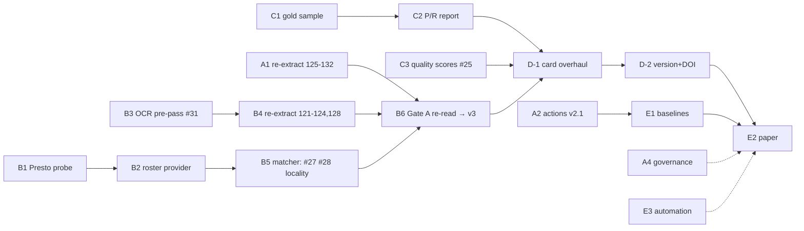

# Plan: publication-ready academic dataset — DRAFT for owner review

**Status:** DRAFT — awaiting owner critique. Not yet a roadmap, not yet issues.
**Date:** 2026-07-30
**Basis:** the critical analysis in `docs/plans/2026-07-29-publication-roadmap.md`
(state of the repo, recon findings in its Appendix A, literature in Appendix B).
This file is the *executable* version: milestones, concrete work items with
acceptance criteria, and the decisions only the owner can make.

**How this becomes real:** after critique, (1) this file is revised and
renamed the roadmap of record, (2) each work item below becomes a GitHub
issue with the acceptance criteria as its definition of done, (3) existing
issues are updated rather than duplicated — the mapping is explicit in each
item.

---

## Goal and non-goals

**Goal:** a dataset a researcher can cite without hidden caveats —
internally consistent across all 12 sessions, quality quantified absolutely
(precision/recall on a hand-labeled sample, not only differential diffs),
correctly licensed, versioned, DOI-bearing, documented to datasheet
standard — plus a submitted data paper.

**Non-goals for this plan** (deliberately deferred, tracked but unscheduled):
fiscal notes (#26), testimony, votes config, pre-121 sessions, embeddings/
search Space. Each starts only after M3, with its own recon issue.

## Milestones

| # | Milestone | Definition of done | Target |
|---|---|---|---|
| M0 | **Land what is built** | Re-extraction for 125–132 published; actions config (v2.1) live; retrospective merged; governance P1 fixed; branches swept | ~1 week (mostly approval windows) |
| M1 | **v3: consistency + enrichment ceiling** | All 12 sessions extracted by one extractor version; roster-backed matching; Gate A re-read everywhere | +2–3 weeks |
| M2 | **Quality measured absolutely** | P/R with CIs per field per era, on the card; per-session quality scores; CI regression guard | overlaps M1, +2 weeks |
| M3 | **v3 packaged & citable** | Card to datasheet standard, correct license, semantic versioning, DOI, BibTeX | +1 week |
| M4 | **Paper submitted** | Baselines run, descriptor paper submitted; weekly automation live | +3–4 weeks, elastic |

Human budget stays ~30 min/day; every item below states what it needs from
that window. Agent labor parallelizes across workstreams A–E.

---

## Workstream A — Land staged work (M0)

### A1. Publish the staged re-extraction for sessions 125–127, 129–132
- **Existing issue:** #13 (item 1). No new issue.
- **Work:** owner inspects staged parquets → enrichment re-run (columns were
  deliberately cleared) → gated publish → re-read Gate A for these sessions
  → update #13's table.
- **Acceptance:** published `sponsors` for these sessions match the staged
  measurement (+~8k mentions); enrichment columns re-populated; Gate A
  numbers posted to #13.
- **Human:** one window — inspect + approve publish. **Decision D1 rides
  along** (session 125, below).

### A2. Merge PR #29 and publish the actions config (v2.1)
- **Existing:** PR #29 (open, Copilot-reviewed). No new issue.
- **Work:** Tier-1 review → merge → dispatch `build-actions` → `publish-actions`
  with `dry_run: true` → approve real publish → verify card configs render.
- **Acceptance:** `load_dataset("pem207/maine-bills", "actions")` works; card
  documents the join and both row grains; #13/#29 updated.
- **Human:** one window (review + environment approval).
- **Risk:** build artifacts expire — if past retention, re-run the backfill
  first (known-good, ~0 failures).

### A3. Merge the sprint retrospective
- **New issue:** none needed — direct small PR from `claude/sprint-writeup`.
- **Acceptance:** `docs/plans/2026-07-29-sprint-retrospective.md` on `main`.

### A4. Governance batch (#21) — at minimum the P1 item
- **Existing issue:** #21. No new issue.
- **Work:** one Tier-1 PR: either configure the branch ruleset or rewrite the
  enforcement section to state what convention vs. machinery guarantees;
  fold in the P2 reviewer-methodology rules (worktree isolation, permissive-
  direction mutations, SIGKILL-safe harnesses).
- **Acceptance:** GOVERNANCE.md's claims verified against actual repo
  settings; #21 checklist items closed.
- **Human:** **Decision D2** (ruleset vs. rewrite) + PR review, one window.

### A5. Branch sweep
- **New issue:** *Proposed issue N1 — "Branch hygiene: delete merged/stale
  branches, archive feature-testimony"*. Small, but issue-worthy because it
  deletes things.
- **Work:** delete 18 merged `claude/*` + `pr16-fix` + `copilot/*`, 3×
  `add-claude-github-actions-*`, `claude/sprint-planning-week-*` (content
  already on main). Tag `feature-testimony` as `archive/feature-testimony`
  before deleting; keep `fixtures/*`.
- **Acceptance:** branch list contains only `main`, active PR branches,
  `fixtures/*`, and the archive tag exists.
- **Human:** approve the deletion list (async comment is fine). **D3.**

## Workstream B — v3 consistency + enrichment (M1)

### B1. Probe the Legislators' Biographical Database (Presto)
- **New issue:** *N2 — "Roster source: probe and scrape the law library's
  Legislators' Biographical Database"*.
- **Work:** `data-run` dispatch (host is proxy-blocked from analysis
  sessions; Appendix A of the analysis doc has URLs and fallbacks): map the
  search/export surface, pull one known legislator per era, then bulk-pull
  sessions 121–124 (~190 rows each: name, chamber, district, **town**,
  party). Fixtures to `fixtures/*`.
- **Acceptance:** parquet/CSV roster per session 121–124 with the five
  fields; spot-checked against 10 known legislators per session (e.g. the
  #13 unmatched leaders: HATCH, PERRY, PINGREE…).
- **Fallbacks, in order:** Wikipedia per-session Senate rosters (structured,
  Senate only) + Legislative Record front-matter PDFs (OCR-era) for the
  House. If all three fail for a session → **D4** fallback: enrichment
  documented as 125+ feature.

### B2. Historical roster provider + session windows
- **New issue:** *N3 — "legislature_roster: historical provider for sessions
  121–124 (+ town data for all sessions)"*. (`legislature_roster.py`
  scaffolding exists.)
- **Work:** provider reads B1's output; same `session_window()` scoping as
  OpenStates (#11); towns normalized to match bill-text locality strings.
- **Acceptance:** roster sizes ~186–201/session; unit tests incl. window
  edges; no change to published data yet.

### B3. OCR pre-pass for roster sweeps (#31)
- **Existing issue:** #31. No new issue.
- **Work:** in #31's recommended order — (a) widen `_ROSTER_WORD` to
  accented capitals; (b) normalization pre-pass scoped to the cosponsor
  block (`Of`→`of`, `ofX`→`of X`, stray punctuation on all-caps tokens);
  (c) check the `BEAR of the Houlton Band of Maliseet Indians` tribal-
  designation gap separately. Contiguity rule untouched.
- **Acceptance:** #31's own bar — measure main vs. branch over published
  `text` for ≥ sessions 121, 124, 128; inspect every distinct gained name;
  zero real names lost; permissive-direction mutation tests on every new
  pattern (per #21 P2).

### B4. Re-extract and publish sessions 121–124 + 128 (and 125 if held)
- **Existing issue:** #13 (item 1, held sessions). No new issue.
- **Work:** after B3 merges: staged re-extraction → owner inspection →
  enrichment re-run → gated publish.
- **Acceptance:** every session's published `sponsors` produced by the same
  extractor commit; the 124 LD 1181-class cascades recovered (75→12 becomes
  ~75 again); losses vs. published ≈ 0 per the B3 measurement.
- **Human:** one window (inspect + approve).

### B5. Matcher upgrades, one pass: initials + denylist + locality
- **Existing issues:** #27, #28. *Proposed issue N4 — "Capture and persist
  sponsor localities; locality-based disambiguation"* (the schema-touching
  part #13 item 2 describes but no issue tracks).
- **Work:** (a) #27: strip trailing `, X.`, break surname ties on roster
  `given_name`; both-or-neither → null. (b) #28: denylist inflections,
  measured with `audit_roster_sweep.py`, zero-names-lost bar. (c) N4:
  persist the already-matched `of <locality>` group as a new nullable
  `sponsor_localities` column aligned with `sponsors`; use roster towns to
  resolve same-chamber ambiguities. Published `sponsors` strings untouched
  (CLAUDE.md invariant).
- **Acceptance:** #27's 164 session-129 mentions resolve; #28 adversarial
  strings rejected with zero real-name loss; ambiguous share for 125–130
  drops materially (target <5%); schema change is additive + nullable.
- **Tier:** the `sponsor_localities` column is **Tier-1** (schema). **D5**
  decides whether it ships in v3 or waits.

### B6. Enrichment re-run + Gate A re-read, all sessions
- **Existing issue:** #13 (closes it, or reduces it to a tracking table).
- **Acceptance:** per-session match table regenerated by both independent
  paths (`run_matching_report.py` and `enrich_published.py`, agreeing to the
  record); 125–132 ≥ 95% or a written explanation per session; 121–124
  either lifted to roster-backed rates or D4 invoked and documented.
- **Human:** one window (publish approval).

## Workstream C — Absolute quality measurement (M2, parallel with B)

### C1. Gold-standard labeled sample
- **New issue:** *N5 — "Gold-standard evaluation set for extraction fields"*.
- **Work:** stratified sample ~300–400 docs (strata: 121–124 / 125–130 /
  131–132 / targeted-hard: rosters, amendments, OCR-heavy). Serve through
  the existing review UI (`tools/review_ui/`), targeted + random modes;
  verdict JSONs land in-repo as fixtures.
- **Acceptance:** every sampled doc has owner-verified sponsors/title/
  committee labels; sampling code + seed committed (reproducible); labels
  usable as pytest fixtures.
- **Human:** the main human cost of the whole plan — est. 4–6 windows of
  labeling. **D6** sizes it.

### C2. Precision/recall report
- **New issue:** *N6 — "Report extraction P/R with confidence intervals per
  field per era"*.
- **Acceptance:** script computes P/R + Wilson CIs from C1 fixtures against
  any extractor commit; numbers for current `main` published on the card
  and in `docs/QUALITY-IMPROVEMENT-HISTORY.md`.

### C3. Mechanical text-quality scores (#25)
- **Existing issue:** #25. No new issue.
- **Work:** per-document unsupervised scores: non-dictionary token rate,
  line-number residue, hyphenation artifacts, OCR-confusion class frequency
  (`TI`-for-`TT` etc. from #13 item 3). Published as a per-session table on
  the card; optionally a per-record column later (Tier-1 if so).
- **Acceptance:** scores computed for all 12 sessions; validated to
  correlate with the known 121–124 vs 125+ era split; framing cites the
  OCR-impact literature (analysis doc, Appendix B).

### C4. CI regression guard on the gold sample
- **Folds into N5/N6** — no separate issue.
- **Acceptance:** a CI job fails when P/R on the gold fixtures moves beyond
  a set tolerance; wired into `ci.yml` (Tier-1 touch, rides a scheduled
  Tier-1 window).

## Workstream D — Packaging (M3)

### D-1. Dataset card overhaul to datasheet standard
- **New issue:** *N7 — "Card overhaul: license, datasheet, quality,
  limitations"*. All changes via the `publish.py` template + tests, never
  hand-edits on the Hub.
- **Work:** fix `license:` front matter (**D7**: recommend `cc0-1.0` for
  data with an explicit government-edicts note; MIT stays for code); fix
  `size_categories` (10K<n<100K); full datasheet sections (Gebru et al.
  framing); per-session match + quality tables; limitations (era
  discontinuity history, OCR classes, enrichment coverage boundary);
  split-leakage warnings (amendments duplicate parent text; carry-over
  bills recur across sessions; recommend session-based splits).
- **Acceptance:** every datasheet question answered or explicitly N/A'd; a
  naive reviewer can find license, provenance, quality, and limitations
  without opening GitHub.

### D-2. Versioning + DOI + citation
- **New issue:** *N8 — "Semantic dataset versioning, DOI, BibTeX"*.
- **Work:** tag HF revisions per release (`v2.1.0`, `v3.0.0`); CHANGELOG
  section on the card mapping version → extractor commit → change; mint DOI
  (**D8**: HF DOI integration vs. Zenodo); `preferred_citation` in front
  matter.
- **Acceptance:** `load_dataset(..., revision="v3.0.0")` reproduces the
  release; DOI resolves; card shows cite-this-version instructions.

## Workstream E — Paper + automation (M4)

### E1. Baseline analyses (three notebooks)
- **New issue:** *N9 — "Baseline analyses for the data paper"*.
- **Work:** (a) outcome prediction (enacted/died from text+sponsors+committee
  via the actions join); (b) cosponsorship networks across 24 years — made
  honest by M1; (c) committee/topic drift across sessions.
- **Acceptance:** each notebook runs from the published dataset alone
  (`load_dataset`, no local files); results reproduced in CI-adjacent smoke
  form; findings summarized for the paper.

### E2. Data-descriptor paper
- **New issue:** *N10 — "Write and submit the dataset descriptor paper"*.
- **Work:** draft against the analysis doc's Appendix B related-work
  grounding (political-science hand-collection gap + NLP near-absence of
  state-level structured bills — BillSum's 1,237 CA bills as nearest prior
  art); methods section leans on the repo's measured-extraction history.
- **Acceptance:** submitted. **D9** picks the venue.

### E3. Weekly freshness automation
- **New issue:** *N11 — "Weekly re-scrape of the active session with
  diff-summary PR; publish stays gated"*. (The sprint plan's GA track,
  never started.)
- **Work:** scheduled workflow: scrape active session → diff vs. published
  → open PR with summary; publish job waits on the environment gate. Uses
  the House CSV export (`/house/Home/ExportActiveMembers`) for current
  rosters — no PDF parsing.
- **Acceptance:** two consecutive scheduled runs produce correct diff PRs
  with zero unattended publishes; documented in the card's maintenance
  section (the paper's maintenance promise depends on this).

---

## Decisions for the owner (the critique I most need)

| # | Decision | Options | Recommendation |
|---|---|---|---|
| D1 | Session 125: publish re-extraction now (19 known OCR-class losses, +294 gains) or hold behind B3? | publish now / hold | **Hold** — it's one pre-pass away from zero-loss, and keeps the 121–128 block together |
| D2 | Governance enforcement: configure the branch ruleset, or rewrite the doc to match reality? | configure / rewrite | **Configure** — ~15 min, makes the paper's provenance story mechanical |
| D3 | Approve the branch-deletion list (A5), incl. tagging + deleting `feature-testimony` | yes / edits | as listed |
| D4 | If all three roster sources fail for 121–124: ship enrichment as a documented 125+ feature? | accept / keep digging | **Accept** — with measured extraction quality still reported for 121–124 |
| D5 | `sponsor_localities` column: ship in v3 or defer? | v3 / defer | **v3** — it's the disambiguation evidence, additive and nullable; one schema review instead of two |
| D6 | Gold-sample size vs. your labeling time | ~200 (3 windows) / ~400 (6 windows) | **~400** — CIs tight enough to survive review; targeted stratum first so early labels carry the most information |
| D7 | Data license on the card | CC0-1.0 / PDDL / `other`+statement | **CC0-1.0** with a government-edicts provenance note; code stays MIT |
| D8 | DOI minting | HF DOI / Zenodo | **HF DOI** — one system, versioned; Zenodo only if a funder requires it |
| D9 | Paper venue | Scientific Data / NeurIPS D&B / PSJ-LSQ application-led | **Scientific Data** descriptor + application-led companion later; D&B if E1 baselines lead |

## Dependency graph

Critical path: **B1 → B2 → B5 → B6 → D-1 → D-2 → E2**, with B3→B4 joining
at B6. Workstream C runs fully parallel; A is this week.

## Issue plan summary

| Reuse as-is | #13 (A1, B4, B6), #21 (A4), #25 (C3), #27/#28 (B5), #31 (B3), PR #29 (A2) |
|---|---|
| **New issues** | N1 branch hygiene · N2 Presto probe/scrape · N3 roster provider · N4 sponsor localities (Tier-1 schema) · N5 gold sample · N6 P/R report · N7 card overhaul (Tier-1) · N8 versioning+DOI (Tier-1) · N9 baselines · N10 paper · N11 automation (Tier-1) |
| Untouched | #26 fiscal notes (post-M3, gets a recon sub-plan then) |

## Open questions for critique

1. Is the M1 target (all-session consistency) the right bar for calling it
   "v3", or should v3 wait for C2's measured P/R so the version bump and
   the quality claim land together?
2. Should N4 (localities) also backfill `sponsor_chambers` nulls where the
   roster now disambiguates — or is that scope creep on a Tier-1 column?
3. The plan assumes the ~30 min/day cadence holds through August. If not,
   which milestone slips first? (My assumption: M2's labeling, since C1 is
   the human-heaviest item.)
4. Anything in the non-goals list you want pulled forward — most plausibly
   votes, since the actions recon already mapped the status pages?
