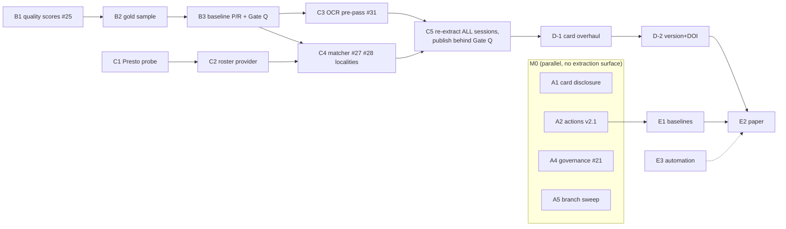

# Plan: publication-ready academic dataset — DRAFT v2 for owner review

**Status:** DRAFT v2 — awaiting owner critique. Not yet a roadmap, not yet issues.
**Date:** 2026-07-30 (v2, same day: quality-first reordering per owner feedback)
**Basis:** the critical analysis in `docs/plans/2026-07-29-publication-roadmap.md`
(state of the repo, recon in Appendix A, literature in Appendix B).

**What changed in v2:** the owner's concern — OCR and extraction problems
polluting the dataset — reorders the plan around a **quality gate (Gate Q)**.
Gold labeling moves first; *every* publish that touches extracted text or
matching now sits behind measured precision/recall, including the staged
125–132 re-extraction that v1 of this plan would have published in week one.
Only work that does not touch extraction (actions config, governance, docs,
branch hygiene) proceeds in parallel. Two additions the reordering enables:
matching ground truth (not just extraction) in the gold sample, and a
text-fidelity check on the `text` column itself.

**How this becomes real:** after critique, (1) this file is revised and
renamed the roadmap of record, (2) each work item becomes a GitHub issue
with its acceptance criteria as the definition of done, (3) existing issues
are updated rather than duplicated — the mapping is explicit per item.

---

## Goal and non-goals

**Goal:** a dataset a researcher can cite without hidden caveats —
internally consistent across all 12 sessions, quality quantified absolutely
(precision/recall on a hand-labeled gold sample, not only differential
diffs), correctly licensed, versioned, DOI-bearing, documented to datasheet
standard — plus a submitted data paper.

**Operating principle (new in v2):** *no publish of extracted or matched
data until Gate Q passes for the sessions being published.* Known problems
in the already-published data are **disclosed on the card immediately**
rather than silently fixed later — label the pollution you know about now,
remove it under the gate.

**Non-goals** (deferred, tracked but unscheduled): fiscal notes (#26),
testimony, votes config, pre-121 sessions, embeddings/search Space. Each
starts only after M3, with its own recon issue.

## Milestones

| # | Milestone | Definition of done | Target |
|---|---|---|---|
| M0 | **Land non-extraction work + disclose** | Actions config (v2.1) live; card carries a Known Issues section; retrospective merged; governance P1 fixed; branches swept | ~1 week |
| M1 | **Quality foundation → Gate Q** | Gold sample labeled (extraction + matching + text fidelity); baseline P/R measured for the current pipeline; Gate Q thresholds agreed and wired into CI | +2–3 weeks (labeling is the long pole) |
| M2 | **v3: fix to the gate, then publish** | Extraction/matching work (#31, #27, #28, rosters, localities) developed against gold; all 12 sessions re-extracted, enriched, and published only on passing Gate Q | +2–3 weeks |
| M3 | **v3 packaged & citable** | Card to datasheet standard with the measured numbers, correct license, semantic versioning, DOI, BibTeX | +1 week |
| M4 | **Paper submitted** | Baselines run, descriptor paper submitted; weekly automation live | +3–4 weeks, elastic |

Human budget stays ~30 min/day. M1's labeling is the human-heaviest item in
the plan and starts immediately so it never blocks M2's agent work.

---

## Workstream A — Non-extraction landings + disclosure (M0)

Everything here either doesn't touch extracted text, or discloses rather
than changes it.

### A1. Known Issues section on the published card — NEW in v2
- **New issue:** *N0 — "Disclose known data issues on the dataset card"*.
- **Work:** via the `publish.py` template (never hand-edits on the Hub): a
  Known Issues section stating plainly (a) sessions were extracted under
  different extractor versions — cosponsor counts are not comparable across
  sessions, with the 131-vs-132 example; (b) sessions 121–124 carry OCR-era
  damage (#31's classes); (c) enrichment coverage is ~84% for 125–132 and
  ~16.5% for 121–124 (roster gap); (d) a fix under a measured quality gate
  is in progress, with a link to this plan.
- **Acceptance:** a consumer reading only the card knows exactly what not
  to trust today. Card-sync run approved through the publish gate.
- **Human:** one window (Tier-1 card change, small).
- **Why first:** this is the direct answer to "pollution" — the polluted
  fields stay published either way until M2; the difference is whether
  users are warned.

### A2. Merge PR #29 and publish the actions config (v2.1)
- **Existing:** PR #29 (open, Copilot-reviewed). No new issue.
- **Why it doesn't wait for Gate Q:** actions come from status *pages*
  (HTML tables), not PDF text extraction — a separate pipeline with its own
  re-validation in the publish script (0 failures across 91,787 actions).
  The gate governs extracted/matched PDF data. If the owner disagrees →
  **D2** flips and this moves behind the gate too.
- **Work:** Tier-1 review → merge → `build-actions` → `publish-actions`
  dry-run → approved publish → verify card configs.
- **Acceptance:** `load_dataset("pem207/maine-bills", "actions")` works;
  join documented. **Risk:** build artifacts expire; re-run backfill if so.
- **Human:** one window.

### A3. Merge the sprint retrospective
- Direct small PR from `claude/sprint-writeup`. No issue.
- **Acceptance:** `docs/plans/2026-07-29-sprint-retrospective.md` on `main`.

### A4. Governance batch (#21) — at minimum the P1 item
- **Existing issue:** #21. No new issue.
- **Work:** one Tier-1 PR: configure the branch ruleset or rewrite the
  enforcement section to match reality; fold in the P2 reviewer-methodology
  rules (worktree isolation, permissive-direction mutations, SIGKILL-safe
  harnesses) — which M2's guard work will rely on.
- **Acceptance:** GOVERNANCE.md's claims verified against actual settings.
- **Human:** **Decision D3** + PR review, one window.

### A5. Branch sweep
- **New issue:** *N1 — "Branch hygiene: delete merged/stale branches,
  archive feature-testimony"*.
- **Work:** delete 18 merged `claude/*` + `pr16-fix` + `copilot/*`, 3×
  `add-claude-github-actions-*`, `claude/sprint-planning-week-*`; tag
  `feature-testimony` as `archive/feature-testimony` before deleting; keep
  `fixtures/*`. **Keep `claude/sprint-reextract-sponsors`** — its staged
  output is evidence M1/M2 will reuse.
- **Acceptance:** only `main`, active PR branches, `fixtures/*`, the
  held re-extraction branch, and the archive tag remain.
- **Human:** approve the list (**D4**, async is fine).

## Workstream B — Quality foundation → Gate Q (M1)

Order within B matters: mechanical scores first (they drive sampling), then
labeling, then baseline measurement, then the gate.

### B1. Mechanical text-quality scores (#25)
- **Existing issue:** #25. No new issue.
- **Work:** per-document unsupervised scores over the published `text`:
  non-dictionary token rate, line-number residue, hyphenation artifacts,
  OCR-confusion class frequency (`TI`-for-`TT`, inserted spaces — the #13
  item-3 classes). Framing per the OCR-impact literature (analysis doc,
  Appendix B).
- **Acceptance:** scores for all 12 sessions; distribution validated
  against the known 121–124 vs 125+ era split; **feeds B2's strata**.
- **Why first in B:** cheap (no human time), and it makes the gold sample
  quality-stratified instead of only era-stratified — the OCR-damaged tail
  the owner is worried about gets oversampled by construction.

### B2. Gold-standard labeled sample — extraction AND matching
- **New issue:** *N5 — "Gold-standard evaluation set: extraction, matching,
  text fidelity"*.
- **Design (expanded in v2):**
  - **Extraction labels** (~300–400 docs): true sponsors, title, committee,
    labeled from the source evidence shown in the review UI. Strata: era
    (121–124 / 125–130 / 131–132) × B1 quality score (worst-decile
    oversampled) × targeted-hard (rosters, amendments, #31's damage
    classes, tribal designations).
  - **Matching labels** (~400–600 sponsor mentions, drawn from the labeled
    docs): the *true legislator identity* per mention, resolved by the
    labeler from town/chamber context. This is what lets us measure match
    precision — a wrong-person match is the worst pollution the dataset can
    contain, worse than a null.
  - **Text fidelity** (~40–60 passages): short passages transcribed by eye
    from the source PDF and diffed against the published `text`, bounding
    character/word error rates per era for the `text` column itself.
- **Method:** existing review UI (`tools/review_ui/`), targeted + random
  modes; verdict JSONs committed as pytest fixtures; sampling code + seed
  committed (reproducible).
- **Acceptance:** every sampled item owner-verified; inter-item coverage of
  all #31 damage classes; fixtures load in tests.
- **Human:** the plan's main human cost — est. 5–7 windows. **D5** sizes
  it. Targeted stratum first, so early labels carry the most information.

### B3. Baseline P/R measurement + Gate Q definition
- **New issue:** *N6 — "Measure baseline P/R; define and wire Gate Q"*.
- **Work:** script computes, from B2 fixtures, for any extractor/matcher
  commit: sponsor extraction P/R, title/committee accuracy, match
  precision/recall (per era, Wilson CIs), text CER/WER bounds. Run it on
  current `main` **and** on the pre-#16 extractor for context. Then wire it
  into CI as a regression guard (Tier-1 `ci.yml` touch).
- **Gate Q — proposed thresholds, for owner critique (D1):**
  | Metric | Threshold to publish a session |
  |---|---|
  | Sponsor extraction precision | ≥ 0.98 per era |
  | Sponsor extraction recall | ≥ 0.95 (125+); ≥ 0.90 or documented (121–124) |
  | Match precision (wrong-person rate) | ≥ 0.995 — near-zero false matches |
  | Match recall | reported, no floor (nulls are honest) |
  | Title accuracy | ≥ 0.95 |
  | Text fidelity | reported per era on the card, no floor initially |
- **Acceptance:** baseline numbers published in
  `docs/QUALITY-IMPROVEMENT-HISTORY.md`; thresholds agreed in writing; CI
  fails on regression beyond tolerance.
- **Human:** one window to critique/ratify thresholds (**D1**).

## Workstream C — Fix to the gate, then publish v3 (M2)

All of v1's extraction/matching work, now developed *against the gold set*
and published only on passing Gate Q. **The staged 125–132 re-extraction
(previously "publish in week one") waits here too** — it gets evaluated
against gold like everything else (**D6**).

### C1. Probe + scrape the Legislators' Biographical Database
- **New issue:** *N2 — "Roster source: probe and scrape the law library's
  Legislators' Biographical Database"*.
- **Work:** `data-run` dispatch (host proxy-blocked from analysis sessions;
  analysis doc Appendix A has URLs, fallbacks, dead ends): map the Presto
  search/export surface; bulk-pull sessions 121–124 (~190 rows each: name,
  chamber, district, **town**, party); fixtures to `fixtures/*`.
- **Acceptance:** roster per session 121–124 with all five fields,
  spot-checked against B2's matching labels (the gold set now doubles as
  the roster's acceptance test).
- **Fallbacks:** Wikipedia per-session Senate rosters, Legislative Record
  front matter. All fail → **D7**: enrichment documented as 125+ feature.

### C2. Historical roster provider
- **New issue:** *N3 — "legislature_roster: historical provider 121–124 +
  towns for all sessions"*. Scaffolding exists.
- **Acceptance:** sizes ~186–201/session; `session_window()` scoping; towns
  normalized to match bill-text locality strings; no published-data change.

### C3. OCR pre-pass for roster sweeps (#31)
- **Existing issue:** #31. No new issue.
- **Work:** #31's order — accented capitals in `_ROSTER_WORD`; cosponsor-
  block-scoped normalization (`Of`→`of`, `ofX`→`of X`, stray punctuation);
  the Houlton Band tribal-designation check. Contiguity rule untouched.
- **Acceptance (strengthened in v2):** #31's differential bar (zero real
  names lost, every gained name inspected, sessions 121/124/128 minimum)
  **plus** recall improvement on B2's gold labels for the damaged strata,
  with no precision drop. Permissive-direction mutation tests per #21 P2.

### C4. Matcher upgrades, one pass: initials + denylist + locality
- **Existing issues:** #27, #28. **New issue:** *N4 — "Capture and persist
  sponsor localities; locality-based disambiguation"* (Tier-1: schema).
- **Work:** (a) #27 trailing-initial resolution, both-or-neither → null;
  (b) #28 denylist inflections, measured; (c) N4: persist the already-
  matched `of <locality>` group as nullable `sponsor_localities` aligned
  with `sponsors`; roster towns resolve same-chamber ambiguities.
  Published `sponsors` strings untouched (CLAUDE.md invariant).
- **Acceptance:** match precision on B2's gold ≥ Gate Q's 0.995 — this is
  the direct test of the owner's matching-quality concern; #27's 164
  session-129 mentions resolve correctly against gold identities; ambiguous
  share 125–130 < 5%; schema change additive + nullable (**D8** ships it in
  v3 or defers).

### C5. Re-extract, re-enrich, publish all 12 sessions — behind Gate Q
- **Existing issue:** #13 (this closes it). No new issue.
- **Work:** once C3/C4 merge: staged re-extraction of **all twelve**
  sessions (125–132 staging refreshed from the held branch's tooling) →
  Gate Q evaluation per session → owner inspection → enrichment re-run →
  gated publish → Gate A re-read.
- **Acceptance:** every session's published data produced by one extractor
  commit; Gate Q passed per session (or a session held with its failure
  documented on the card); both independent match-report paths agree;
  card's Known Issues section (A1) updated to reflect what was fixed.
- **Human:** two windows (threshold sign-off happened in B3; here:
  inspection + publish approval).

## Workstream D — Packaging (M3)

### D-1. Dataset card overhaul to datasheet standard
- **New issue:** *N7 — "Card overhaul: license, datasheet, quality,
  limitations"* (Tier-1). All via the `publish.py` template + tests.
- **Work:** fix `license:` (**D9**: recommend `cc0-1.0` for data +
  government-edicts note; MIT stays for code); fix `size_categories`; full
  datasheet sections (Gebru et al.); **B3's measured P/R and text-fidelity
  tables become the card's quality section** — the payoff of gold-first is
  that the card states measured numbers, not process claims; limitations
  (era discontinuity history, OCR classes, enrichment boundary);
  split-leakage warnings (amendments duplicate parent text, carry-over
  bills recur; recommend session-based splits).
- **Acceptance:** every datasheet question answered or explicitly N/A'd; a
  reviewer finds license, provenance, measured quality, and limitations
  without opening GitHub.

### D-2. Versioning + DOI + citation
- **New issue:** *N8 — "Semantic dataset versioning, DOI, BibTeX"* (Tier-1).
- **Work:** tagged HF revisions per release; CHANGELOG on the card mapping
  version → extractor commit → measured quality at release; DOI (**D10**:
  HF vs. Zenodo); `preferred_citation` front matter.
- **Acceptance:** `load_dataset(..., revision="v3.0.0")` reproduces the
  release; DOI resolves; cite-this-version instructions on the card.

## Workstream E — Paper + automation (M4)

### E1. Baseline analyses (three notebooks)
- **New issue:** *N9.* (a) outcome prediction via the actions join; (b)
  cosponsorship networks across 24 years — now defensible because network
  edges rest on gate-passed extraction; (c) committee/topic drift.
- **Acceptance:** each runs from the published dataset alone; findings
  summarized for the paper.

### E2. Data-descriptor paper
- **New issue:** *N10.* Draft against the analysis doc's Appendix B
  grounding. **The gold-set methodology and Gate Q are now a paper section,
  not just process** — a state-bill dataset with hand-labeled P/R bounds is
  itself part of the contribution (BillSum's 1,237 CA bills, the nearest
  prior art, reports none).
- **Acceptance:** submitted. **D11** picks the venue.

### E3. Weekly freshness automation
- **New issue:** *N11* (Tier-1). Scheduled scrape of the active session →
  diff-summary PR; publish waits on the environment gate **and now also on
  the Gate Q CI check**; House CSV export for current rosters.
- **Acceptance:** two consecutive runs produce correct diff PRs, zero
  unattended publishes; maintenance policy documented on the card.

---

## Decisions for the owner

| # | Decision | Options | Recommendation |
|---|---|---|---|
| **D1** | **Gate Q thresholds** (B3's table) — the numbers that operationalize "maximally confident" | ratify / adjust | ratify as proposed; the 0.995 match-precision floor is the one doing the most work |
| D2 | Does the actions config (A2) wait for Gate Q too? | publish in M0 / hold | **Publish in M0** — different pipeline, no PDF extraction; holding it gains no extraction confidence |
| D3 | Governance enforcement: configure ruleset or rewrite doc | configure / rewrite | **Configure** (~15 min) |
| D4 | Approve branch-deletion list (A5) | yes / edits | as listed, keeping the re-extraction branch |
| D5 | Gold-sample size vs. labeling time | ~250 (4 windows) / ~400 + matching + fidelity (6–7 windows) | **Full ~400** — it's the foundation everything now rests on; under-sizing it undercuts the reordering's whole point |
| D6 | Staged 125–132 re-extraction: still publish early (v1 plan), or hold for Gate Q with everything else? | early / hold | **Hold** — consistent with the operating principle; A1's card disclosure covers users meanwhile |
| D7 | If all roster sources fail for 121–124 | accept 125+ enrichment boundary / keep digging | **Accept**, documented |
| D8 | `sponsor_localities` column in v3 or deferred | v3 / defer | **v3** — one schema review, and it's the disambiguation evidence |
| D9 | Data license | CC0-1.0 / PDDL / other | **CC0-1.0** + government-edicts note; code stays MIT |
| D10 | DOI minting | HF / Zenodo | **HF DOI** |
| D11 | Venue | Scientific Data / NeurIPS D&B / PSJ-LSQ-led | **Scientific Data** descriptor + application companion later |

## Dependency graph

Critical path: **B1 → B2 → B3 → C3/C4 → C5 → D-1 → D-2 → E2**. C1→C2
(roster work) is agent-parallel and joins at C4; it can start in M1 since
it publishes nothing. The human long pole is B2's labeling, which is why it
starts the moment this plan is approved.

## Issue plan summary

| Reuse as-is | #13 (C5), #21 (A4), #25 (B1), #27/#28 (C4), #31 (C3), PR #29 (A2) |
|---|---|
| **New issues** | N0 card disclosure (Tier-1) · N1 branch hygiene · N2 Presto probe/scrape · N3 roster provider · N4 sponsor localities (Tier-1) · N5 gold sample · N6 baseline P/R + Gate Q (Tier-1 via ci.yml) · N7 card overhaul (Tier-1) · N8 versioning+DOI (Tier-1) · N9 baselines · N10 paper · N11 automation (Tier-1) |
| Untouched | #26 fiscal notes (post-M3) |

## Open questions for critique

1. **Gate Q scope:** should the gate also apply retroactively — i.e., if
   baseline measurement (B3) shows currently-published sessions *below*
   threshold, do we pull/annotate them before M2 fixes land, or does A1's
   disclosure suffice until then? (My proposal: disclosure suffices;
   pulling data creates a reproducibility hole for anyone mid-analysis.)
2. **Labeling protocol:** single-labeler (you) with agent pre-fill to
   verify, or double-label a subsample to estimate your own error rate?
   Double-labeling ~15% adds one window but gives the paper an
   inter-annotator figure reviewers may ask for.
3. **Text-fidelity floor:** B3 proposes reporting CER/WER without a
   publish floor initially, since OCR-era text can't be materially improved
   without re-OCRing the scans. Is re-OCR (e.g., modern OCR over the 121–124
   PDFs) in scope for this plan, or explicitly out (my recommendation: out,
   noted as future work)?
4. The plan assumes ~30 min/day through August. If that slips, B2 stretches
   and everything in M2+ slides with it — acceptable, or should the gold
   sample be sized down (D5) to protect the calendar?
